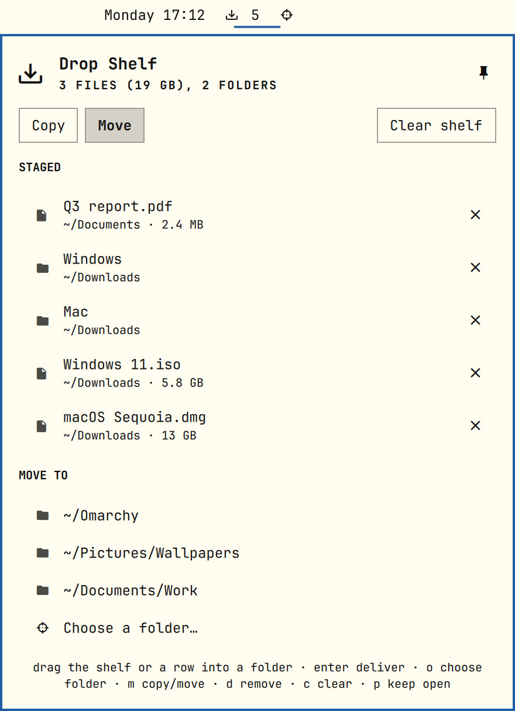

# Drop Zone



A drop zone in the Omarchy bar, inspired by the shelf in NotchNook. Gather files from all over your disk onto it: drag them
from Nautilus (or anything that drags files), or copy them in the file manager and press **Paste**, a few at a time, as often as
you like. Each one is staged: the shelf remembers *where the files are* and touches nothing. When you are ready, deliver the
whole batch at once:

- **drag the shelf into a folder**: grab the icon in the bar and drop it on a Nautilus window or folder,
- **press the target** next to it and choose a folder, or pick one of your recent folders, or
- **send it to an SSH host**: pick a host from your `~/.ssh/config` and a folder on it.

Everything staged is copied, moved, or packed into one zip there, depending on the mode.

## Using it

| Where | What |
|---|---|
| Bar, shelf icon | Drop files on it to stage them. It lights up while you hold files over it. Shows how many are staged. Click for the panel. Drag it into a folder to deliver. |
| Bar, target | Appears once something is staged. Opens the folder chooser and delivers there. While a delivery runs it becomes a stop button. |
| Mode | **Copy**, **Move** or **Zip** (one archive in the target: `name.zip` for one item; for several, this machine's name and the time, like `laptop-2026-10-06-12-45-30.zip`). |
| Panel | The staged list (name, where it lives, size; drag a row out to deliver just that one; the open panel also takes drops), *Paste* (stage what you copied in the file manager), recent folders, recent hosts, *Copy paths*, *Remove missing*, *Clear shelf*. After a local delivery, *Open folder* shows the result with the new files selected. |
| Send to host | Pick an SSH host (one button per host) and type a folder on it (`~` is its home; the last folder per host is remembered). Copy, Move and Zip all work. |
| Pin (panel header) | Keeps the panel open while you work in other windows, so you can drag files straight into it. Pinned, it ignores clicks outside itself; close it from the shelf icon or unpin. The pin is remembered. |
| Keys in the panel | `j`/`k` move · `enter` deliver to the highlighted folder or host · `o` choose folder · `h` send to a host · `m` cycle copy/move/zip · `v` paste · `y` copy paths · `f` open the last folder · `d` remove from shelf · `c` clear · `s` stop · `p` pin |

**Copy** and **Zip** leave the originals in place and, by default, clear the delivered items off the shelf (turn on *Keep files on
the shelf after copying* to deliver the same set to several places). **Move** takes them from where they were; moved items always
leave the shelf. When a delivery finishes you get a notification (turn it off in the settings); for a local folder it has an
*Open folder* button.

Nothing is ever overwritten, locally or on a host. If a name is taken in the target folder, the new copy becomes `name (2).ext`,
`name (3).ext` and so on. A file that disappeared after you staged it is shown in red and skipped; *Remove missing* takes those off
the shelf.

Dragging the shelf out works differently from the target button: the **file manager** does the copy or move, so name clashes
are its call (Nautilus asks whether to merge or replace), and it never tells the shelf where the files went. Afterwards the shelf
only checks what is still in place. In move mode it keeps watching the dragged items for two minutes, so the ones that move after
you answer the file manager's questions still leave the shelf. In copy mode everything stays until you clear it. Use the target
button when you want the shelf's own never-overwrite delivery.

## Settings

| Setting | Default | |
|---|---|---|
| Keep files on the shelf after copying | off | Copies and zips leave the shelf as well, unless this is on. |
| Notify when a delivery finishes | on | Failures always notify. |
| SSH hosts offered | empty | Comma-separated aliases. Empty offers every concrete `Host` in `~/.ssh/config` (and files it `Include`s), except git-only hosts (`User git`). |

## Install

```bash
omarchy plugin add https://github.com/cgranier/omarchy-drop-shelf.git --enable
omarchy plugin enable cgranier.dropshelf center --after omarchy.clock
```

The second line puts it right after the clock, in the middle of the bar. (The plugin was called Drop Shelf until 0.2.0; its id
and repository keep that name.)

**Requirements:** `wl-clipboard` (Paste, Copy paths) and `ssh` (Send to host) are part of Omarchy. A host you send to needs
`sh`, `tar` and `mv`: any Linux or macOS machine, not Windows.

## Remove

```bash
omarchy plugin disable cgranier.dropshelf
omarchy plugin remove cgranier.dropshelf
rm -rf ~/.local/state/dropshelf   # optional: the staged list and recent folders and hosts
```

## How it handles your files

- The shell never reads or writes a file itself. `bin/dropshelf` (Python, standard library plus PyGObject for *Open folder*) does,
  and every path reaches it on **stdin**, never in its arguments, so other local users cannot read your file names from `/proc`.
- **State** (staged paths, mode, pin, last five folders and hosts) lives in `~/.local/state/dropshelf/state.json`, at most 512 KB
  and 200 items. The helper reaches it through directory descriptors from `$HOME` down, refusing symlinks and directories it does
  not own, and replaces it atomically.
- **Delivery** opens the target folder once (it must be yours) and creates everything relative to it with
  `O_CREAT|O_EXCL|O_NOFOLLOW`, so nothing already there, including a planted symlink, is ever followed or replaced. Moves use
  `renameat2(RENAME_NOREPLACE)`. Across file systems a move is a full copy first; the original is removed only if it is still the
  same file afterwards and nothing inside it had to be skipped. Links inside folders are copied as links; sockets, FIFOs and
  devices are skipped and reported. A zip is a new file created the same way; links inside folders are left out of it.
- **Nothing is read by path after it was checked.** Every file and folder Drop Zone copies, zips or sends is opened with `O_NOFOLLOW`
  relative to the open folder it sits in, confirmed with `fstat` to be the same file that was looked at (same device and inode), and
  read through that descriptor. A file swapped for a link, or for another file, in between is refused, never read. (The tar stream for
  SSH is built this way too, rather than with `tarfile.add`, which reopens files by path; reported by the marketplace reviewer on #10285.)
- **Copies follow your umask**, like `cp` without `-p`: a world-writable source does not become a world-writable copy.
- **Sending to a host** runs `ssh -T -o BatchMode=yes -- <alias> sh -c '<fixed script>'`. The host must be a plain alias. The
  folder and the files travel on ssh's stdin (the folder on the first line, then a tar stream), never on any command line, here or
  there. The script is fixed text with no values spliced in: it unpacks into a private temporary folder inside the target, puts
  each item in place with `mv -n` under the first free name, reports each one, and removes the temporary folder. A move deletes
  a local original only after the host reported it in place, and only if it is still the same file or folder that was sent.
  The folder on the host must be yours and not writable by group or others (a shared folder such as `/tmp` is refused), so no one
  else on the host can race the placement. Zip to a host builds the archive in a private folder under `~/.cache/dropshelf` first, sends that one file, and removes the
  folder afterwards, also after a failure or a stop; temp folders left by a run that was killed outright are cleared two hours later. Messages from the host are stripped of colour codes and control characters.
- **Paste** reads the clipboard (capped at 1 MB) and keeps only lines that are file URIs or absolute paths; any other text is
  ignored and never shown. **Copy paths** hands the paths to `wl-copy` over stdin.
- **Stopping** a delivery removes whatever the current item had written so far and never touches an original.
- The folder chooser is Omarchy's own `omarchy-file-select` (the desktop portal). *Open folder* asks the file manager over D-Bus.
- Every process has a deadline, and every output is capped before the shell reads it.

## Tests

```bash
node tests/model.test.js
bash tests/dropshelf.test.sh    # includes SSH sends against a stand-in ssh; no network
/usr/bin/python3 tests/send_race.test.py   # a checked file swapped for a link or another file is never read
```

## Notes

- Needs the built-in Omarchy bar. Under a replacement bar the shelf shows as unavailable.
- Only local files can be staged. Links dragged from a browser are counted and ignored.

MIT licensed.
